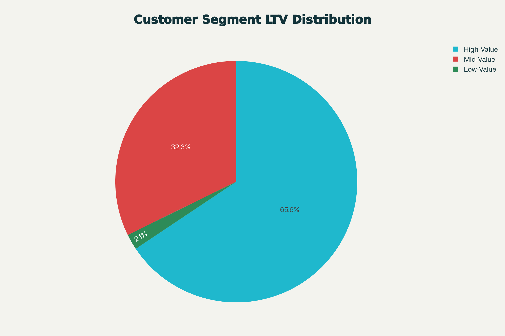
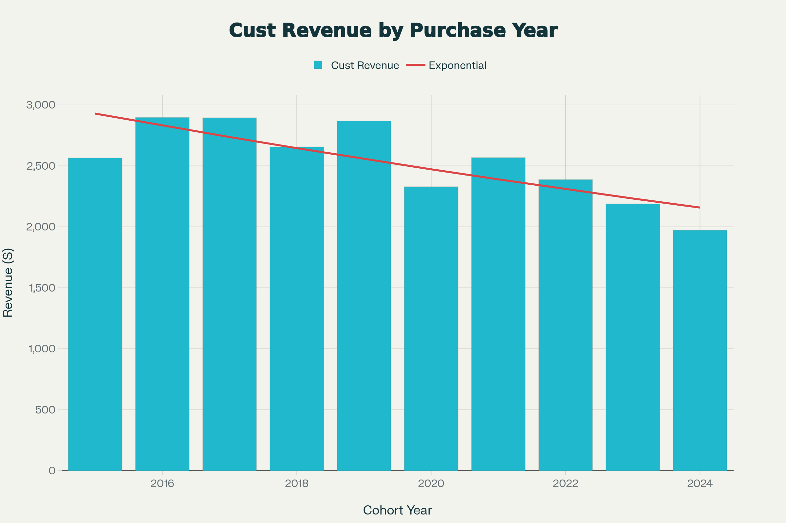
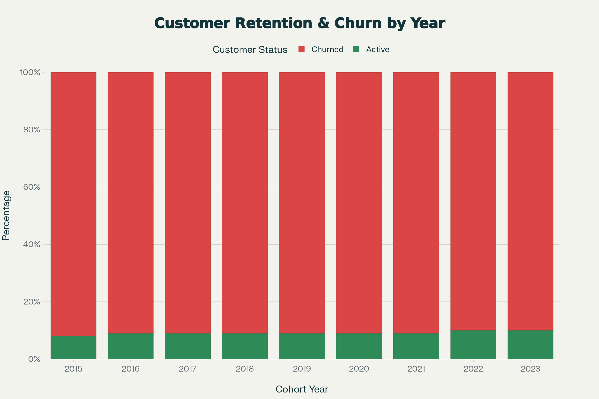
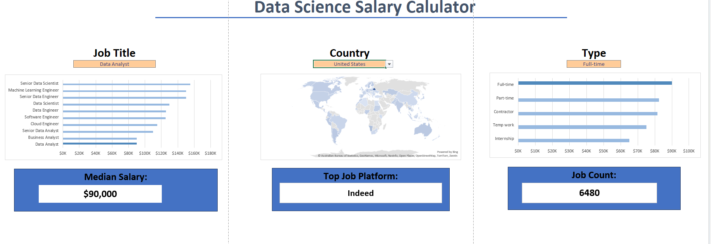
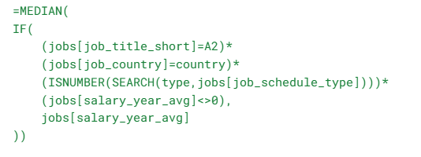

# Anuna's - Data Analyst Portfolio
## About
Hi! I’m Anuna, a recent Master’s graduate in Business Analytics with a background in Economics. I’m passionate about turning data into actionable insights and using analytics to solve real-world business problems.

During my studies and projects, I’ve worked extensively with Python, Excel, SQL, and data visualization tools to analyze datasets, perform statistical analyses, and communicate findings effectively. I enjoy exploring datasets related to consumer behavior/insights, marketing trends, and product reviews that help drive smarter business decisions.

## Project 1 - Sentiment Analysis on Sephora Reviews

**a. Objective**

This project analyzes customer reviews from Sephora using Natural Language Processing (NLP) techniques to extract sentiment and uncover key themes affecting customer satisfaction.

**b. Key Features**

- Data preprocessing (cleaning, tokenization, etc.)

- Sentiment analysis (model used, e.g., VADER, BERT, or TextBlob)

- Visualization of sentiment distribution

- Insights derived from the analysis

**c. Technologies Used**

- Python

- Pandas, NumPy

- NLTK/spaCy/TextBlob

- Matplotlib/Seaborn

- Jupyter Notebook

**d. Key Insights:**

- Higher star ratings align with more positive sentiment.

- Longer reviews tend to express stronger sentiment (positive or negative).

- Mid/high-priced products slightly outperform low-priced ones in ratings.

- Skincare and Makeup categories have higher sentiment than Haircare.

- Price alone does not significantly determine sentiment (ANOVA test shows weak effect).

## Project 2 - Walmart Sales Analysis & Forecasting

 

**a. Objective**

To analyze Walmart’s historical sales data to uncover key patterns, understand how external factors (fuel price, temperature, unemployment rate, holidays) influence sales performance, and build a predictive model to forecast future sales trends.

**b. Key Features**

- Conducted data cleaning and transformation in SQL and Power BI for accuracy and consistency.

- Built interactive Power BI dashboards to visualize time-based and factor-based sales patterns.

- Performed comparative analysis to assess the impact of holidays, fuel prices, and economic indicators on sales.

- Implemented forecasting models using Power BI’s built-in predictive analytics to project future sales.

**c. Technologies Used**

- SQL – for data extraction, aggregation, and metric calculation

- Power BI – for dashboard design, DAX calculations, and forecasting visualization

- Excel – for initial data exploration and validation

**d. Key Insights**

- Sales Timing: Sales are consistently higher in the first half of each month (Days 1–15), indicating stronger early-month purchasing behavior.

- Seasonal Patterns: June, July, and August rank among the top months for sales, showing strong summer seasonality.

- Holiday Impact: Presence of holidays increases sales by about 8 million USD, but overall sales contributions remain nearly balanced between holiday and non-holiday periods (~50/50).

- Focus marketing campaigns and promotions in early months and summer seasons to capitalize on peak demand.

- Plan inventory and staffing ahead of holiday periods and summer months.

## Project 3 - Contoso Business Analytics: Sales, Cohorts & Churn

**a. Objective**

This project analyzes e-commerce customer behavior using SQL, focusing on segmentation, cohort performance, and retention patterns. The goal is to understand customer value, identify churn risks, and provide data-driven strategies to improve retention and maximize revenue.

**b. Key Features**

Customer Segmentation:
- Categorized customers by Lifetime Value (LTV)
- Grouped into High-, Mid-, and Low-value segments
- Calculated segment-level revenue contribution

Cohort Analysis:
- Grouped customers by year of first purchase
- Analyzed revenue and customer trends across cohorts

Retention Analysis:
- Identified customers at risk of churn
- Analyzed last purchase behavior and long-term churn patterns

**c. Technologies Used**

- PostgreSQL

- SQL (CTEs, window functions, aggregations)

- PGAdmin / DBeaver

- Perplexity (visualization generation)

**d. Key Insights**

 

Customer Segmentation:
- High-value customers (25%) generate 66% of total revenue ($135.4M)
- Mid-value customers (50%) contribute 32% ($66.6M)
- Low-value customers (25%) make up only 2% ($4.3M)

 

Cohort Analysis:
- Revenue per customer is declining over time
- 2022–2024 cohorts underperform compared to earlier groups
- Net revenue is rising mainly due to more customers, not higher value
- A drop in 2023 customer acquisition signals potential long-term decline

 

Retention:
- Cohort churn plateaus at ~90% after 2–3 years
- Consistently low long-term retention (8–10%) across all cohorts
- Newer cohorts mirror older churn patterns, indicating systemic issues

**e. Strategic Recommendations**

Customer Value Optimization: 
- Launch a VIP program for 12,372 high-value customers
- Personalize promotions to shift mid-value customers upward
- Use discounts & frequency-based incentives for low-value customers

Cohort Performance Strategy:
- Re-engage 2022–2024 cohorts with targeted offers
- Build loyalty/subscription programs to stabilize cohort value
- Apply tactics from strong 2016–2018 cohorts to newer ones

## Project 4 - Data Jobs Salary Dashboard: Compensation, Skills & Geographic Insights

 

**a. Objective**

This project analyzes real-world data science job information from 2023 using Excel, focusing on salary trends across job titles, countries, and schedule types. The goal is to help job seekers understand compensation ranges, identify high-paying roles, and make data-driven career decisions.

**b. Key Features**

Salary Visualization:
- Built a bar chart comparing median salaries by job title
- Sorted salary data to highlight high-paying vs. low-paying roles
- Displayed clear patterns showing senior and engineering positions earning more than analyst roles

Geographic Salary Mapping:
- Created a map chart to visualize median salaries by country
- Color-coded regions to highlight global compensation disparities
- Enabled fast recognition of which countries offer the highest median pay

Excel Automation & Calculations:
### Median Salary Calculation
 
 Used a multi-criteria array formula to calculate median salary by job title, country, and schedule type:

- Filters by job title, country, and schedule type
- Excludes missing or zero salary values
- Powers all calculations used in the dashboard tables

Data Cleaning & Validation:
- Created a filtered list of unique schedule types using the FILTER() function
- Removed invalid entries (“and”, commas, zeros) to ensure accurate user selections
- Implemented data validation dropdowns for job title, country, and schedule type to improve usability and consistency

**c. Technologies Used**

- Microsoft Excel
  
- Charts (Bar Chart, Map Chart)

- Functions & Formulas (MEDIAN, IF, FILTER)

- Data Validation

- Lookup and array formulas

**d. Key Insights**

Salary Trends by Job Title:
- Senior-level and engineering roles consistently earn higher median salaries
- Analyst positions fall on the lower end of the salary spectrum
- Sorting salaries highlights clear progression in pay with experience and specialization

Geographic Salary Differences:
- Significant variation in pay across countries
- High-income regions show noticeably higher median salaries
- Map visualization makes salary disparities immediately identifiable

Schedule Type & Compensation:
- Salary levels also depend on job schedule type (full-time, hybrid, remote, etc.)
- Filtering by validated schedule types allows accurate comparisons
- The dashboard lets users tailor salary insights based on the job style they want
